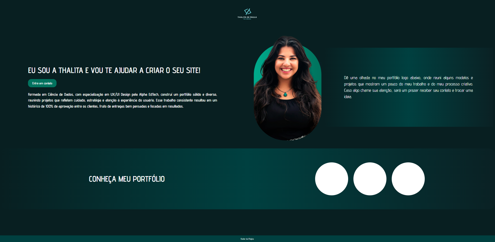

Portfólio de Thalita de Paula

Bem-vindo ao repositório do portfólio pessoal de Thalita de Paula. Esta página foi criada para apresentar habilidades em UX/UI Design, Ciência de Dados e desenvolvimento web, reunindo projetos e informações profissionais de forma clara, elegante e responsiva.

link da página:https://thalitafelima.github.io/DesafioRel-mpago/

📌 Sobre a Página

A página é um portfólio online responsivo, que destaca:

Introdução pessoal e contato direto via WhatsApp.

Apresentação visual da Thalita (imagem de perfil e informações).

Seção de portfólio com botões interativos que abrem modais de galeria com projetos.

Design moderno, com gradientes, cards destacados e tipografia elegante.

Layout totalmente responsivo, funcionando em desktops, tablets e celulares.

🎨 Tecnologias Utilizadas

HTML5 – Estrutura semântica da página.

CSS3 – Estilização avançada com flexbox, grid e gradientes.

Galeria de projetos com modais – Interatividade via checkbox CSS puro, sem JavaScript.

Fontes Google Fonts – Fonte Advent Pro para tipografia elegante.

🖼 Estrutura de Pastas
/ (raiz do projeto)
│
├─ index.html          # Página principal
├─ style.css           # (embutido no HTML neste projeto)
├─ logo.png            # Logotipo do portfólio
├─ profile.png         # Foto de perfil
└─ Galeria_portfólioI/ # Pasta com imagens de cada projeto
     ├─ prt1_1.png
     ├─ prt1_2.png
     ├─ prt1_3.png
     ├─ prt1_4.png
     ├─ prt1_5.png
     ├─ prt2_1.png
     ├─ prt2_2.png
     ├─ prt2_3.png
     ├─ prt3_1.png
     ├─ prt3_2.png
     └─ prt3_3.png

⚙️ Funcionalidades

Seção de apresentação: título, descrição e botão de contato.

Card de perfil: imagem destacada e texto explicativo.

Cards de portfólio:

Card 3: texto “CONHEÇA MEU PORTFÓLIO”.

Card 4: botões circulares que abrem modais com slides de projetos.

Modais de galeria: navegação entre imagens com indicadores (sem JS, apenas CSS).

Responsividade: adaptação automática para diferentes larguras de tela.

📐 Layout e Design

Gradientes sutis nos cards 3 e 4 para realce visual.

Cards maiores para conteúdo textual com boa leitura.

Botões circulares estilizados e interativos.

Tipografia elegante e moderna para títulos, textos e botões.

🚀 Como Visualizar

Clone o repositório:

git clone https://github.com/seu-usuario/portfolio-thalita.git

Abra o arquivo index.html em seu navegador.

Navegue pelos cards e teste os modais de galeria clicando nos botões numerados.

📱 Responsividade

Desktop: 2 colunas de cards, galeria centralizada.

Tablet: cards ajustados e degradê reduzido.

Mobile: 1 coluna de cards, botões e textos redimensionados.

📂 Estrutura do Código

HTML semântica para acessibilidade.

CSS embutido para controle total do design.

Layout baseado em CSS Grid e Flexbox.

Checkbox toggles para modais, evitando dependência de JS.

🔗 Contato

Entre em contato diretamente via WhatsApp:

https://wa.me/5532988397818

📜 Licença

Este projeto está licenciado sob a MIT License
